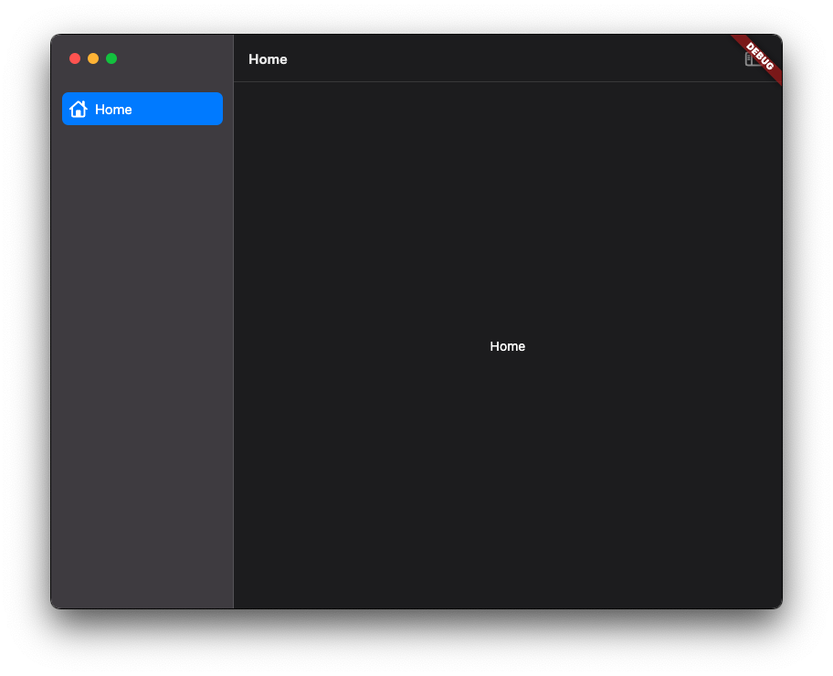

Fire up a generated application in minutes using `mason_cli`

:::tip
This guide is appropriate for developers who are already comfortable with Flutter and the command line. If you're newer to Flutter, check out the [Writing your first app](first_app.md) codelab.
:::

### Overview

To bootstrap a pre-configured Flutter application for macOS with `macos_ui`, you can use [`package:mason_cli`](https://pub.dev/packages/mason_cli). It will generate a project according to your specifications and run `flutter pub get` for you.

### Step 1: Install `mason_cli`

```sh
# 🎯 Activate from https://pub.dev
$ dart pub global activate mason_cli
```

```sh
# 🍺 Or install from https://brew.sh
$ brew tap felangel/mason
$ brew install mason
```

### Step 2: Install the starter template

This step installs the [`macosui_starter`](https://brickhub.dev/bricks/macosui_starter/1.2.0) application template from [brickub.dev](https://brickhub.dev) so that you can use it.

```sh
# Install to a particular directory
$ mason add macosui_starter
```

```sh
# Install globally
$ mason add -g macosui_starter
```

### Step 3: Generate the starter app

This step is similar to running `flutter create` or creating a new Flutter project via your IDE.

```sh
$ mason make macosui_starter
```

Follow the prompts to set your preferred configuration for the app. Once the process is complete, you can open the generated app in your IDE of choice and run it.

Depending on the configuration you chose, the application should look something like this:


For more details on configuring your starter application, check out the [`macosui_starter`](https://brickhub.dev/bricks/macosui_starter/1.2.0) listing on [brickhub.dev](https://brickhub.dev).